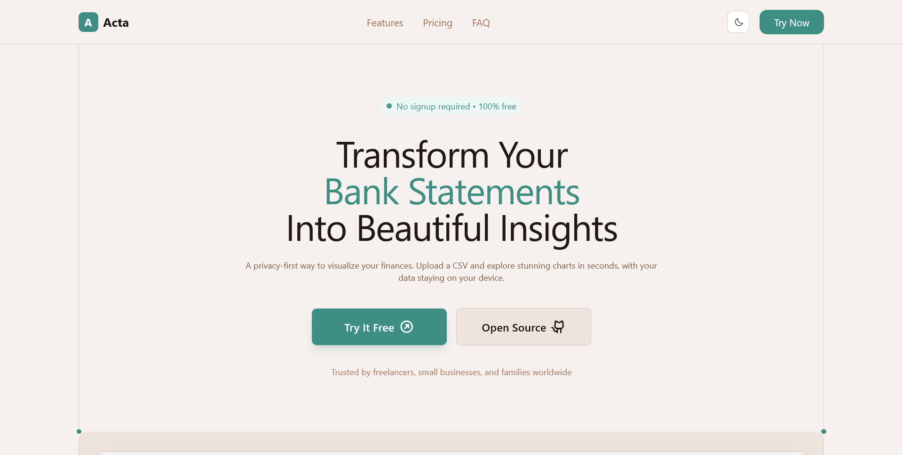
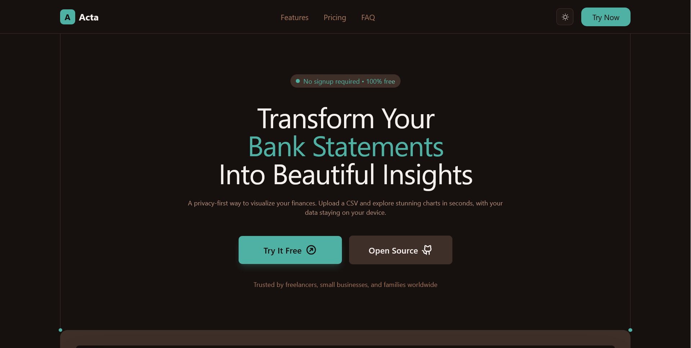
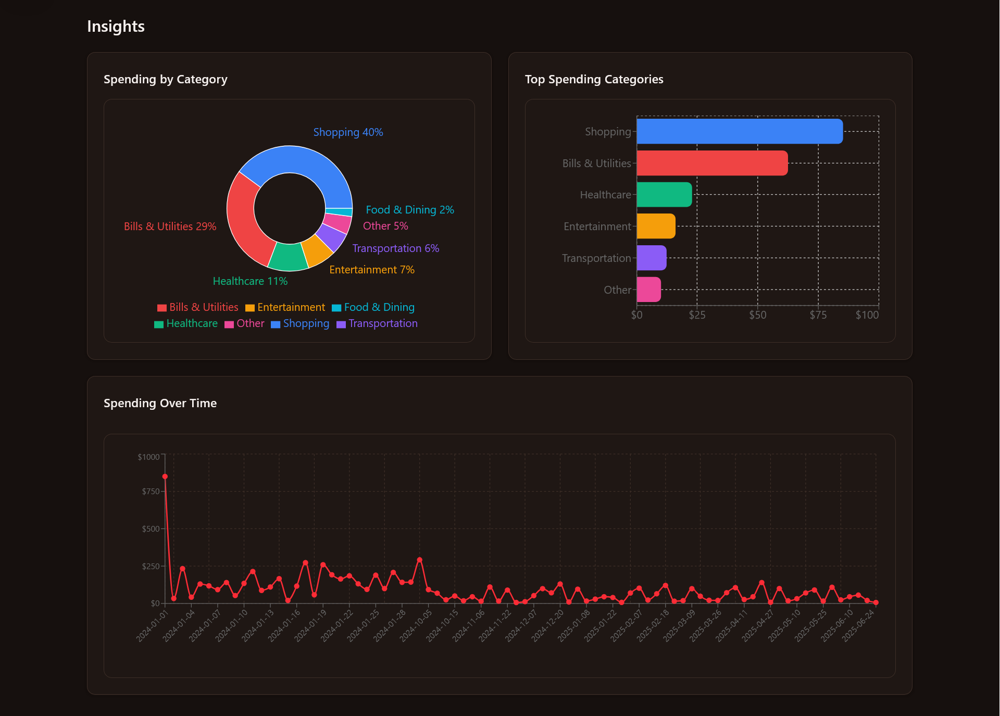
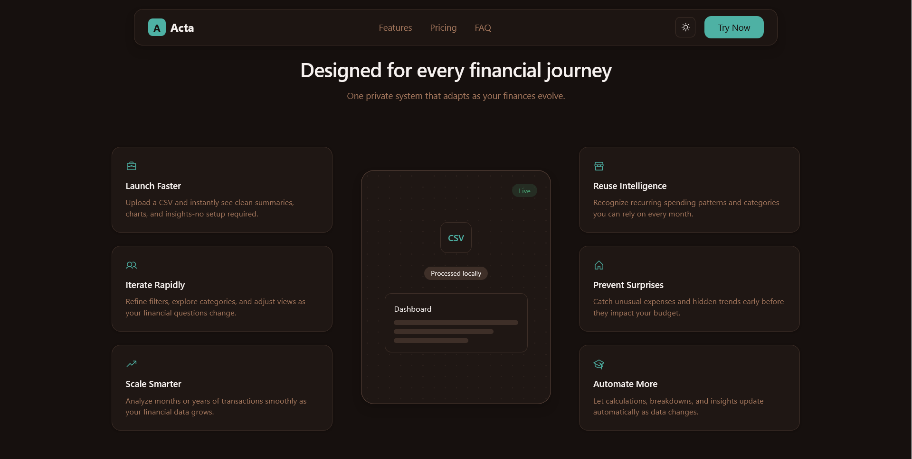

# Acta: Turn Bank CSVs Into Clear Financial Insights

A personal finance tracker that visualizes your spending. Upload your bank CSV and see where your money goes. Everything happens in your browser, so your data stays private.

🔗 **Live Demo:** https://acta-beta.vercel.app/

🎥 **Demo Video:**  
[](https://www.youtube.com/watch?v=1pGYh7BOTs4)

## What It Does

- Upload bank statements (CSV format)
- See spending breakdown by category
- Interactive charts and graphs
- Filter transactions by date/category
- Export reports to PDF
- Dark mode included

## Built With

- Next.js 15 & React 19
- Tailwind CSS for styling
- Recharts for the graphs
- Papaparse for CSV files

## How to Run

```bash
git clone https://github.com/uttam-on-git/acta.git
cd acta
npm install
npm run dev
```

Open http://localhost:3000

## Features

- All client-side processing (no backend needed!)
- Automatic transaction categorization
- Responsive design for mobile
- Real-time chart updates

## Screenshots







## What I Learned

This was my first time working with data visualization in React. Learned a lot about:
- Performance optimization with useMemo
- Handling large CSV files
- Building a proper design system

## Future Ideas

- Export to Excel
- Local storage persistance

---

Built with ☕ and lots of Stack Overflow